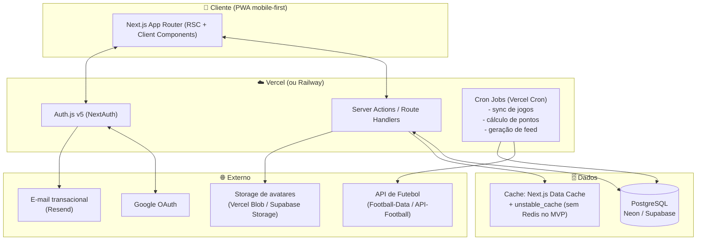
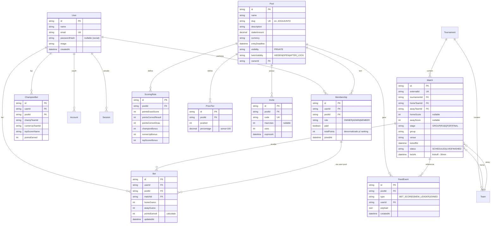
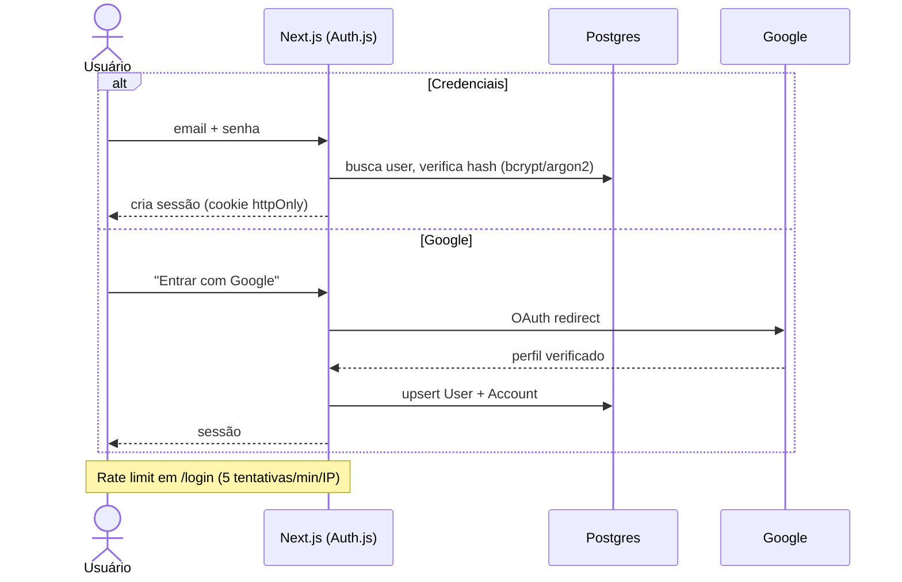
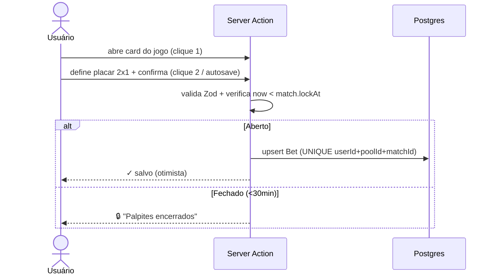
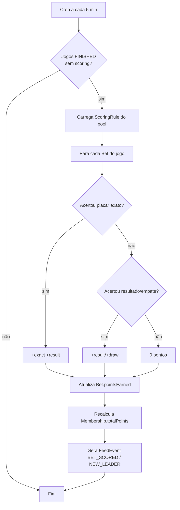
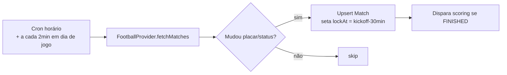
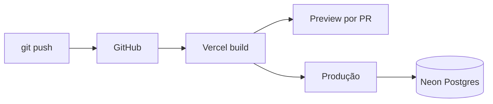

# Bolão Copa do Mundo FIFA 2026 — Arquitetura Completa

> Documento de arquitetura, produto e UX.
> Princípio condutor: **"Não use uma bazuca para matar uma formiga."**
> Monólito moderno, simples, barato, performático e fácil de evoluir.

---

## 1. Visão Geral do Produto

Plataforma web (mobile-first) para criar **bolões privados** da Copa 2026, convidar amigos por link/código, registrar palpites em **2 cliques** e acompanhar **classificação em tempo quase real**, com feed de atividades, palpites bônus (campeão/vice/artilheiro) e premiação configurável.

**Personas**
- **Admin do bolão**: cria o bolão, define regras de pontuação, premiação, convida e (opcional) confirma pagamentos. Pode realizar palpietes como um participante.
- **Participante**: entra por link, palpita rápido, acompanha ranking e feed.

**Promessa de UX**
- Tela inicial = jogos do dia + meu palpite inline + botão editar. Zero navegação supérflua.
- Registrar/editar palpite: abrir card → digitar 2 placares → salva automático (sem botão "salvar" obrigatório; autosave com debounce).
- Travamento automático **30 min antes** do apito inicial.

**Escopo consciente do que NÃO é**: não é casa de apostas, não processa pagamento real no MVP (rateio é informativo/manual via Pix), não tem app nativo (PWA resolve).

---

## 2. Arquitetura Recomendada

**Monólito Next.js full-stack** (App Router) + PostgreSQL gerenciado + um worker de jobs (cron) no mesmo deploy. Sem microserviços, sem mensageria, sem Kubernetes.



**Decisões-chave**
- **Server Actions** para mutations (palpite, criar bolão) — menos boilerplate que REST, type-safe ponta a ponta.
- **Route Handlers** apenas para webhooks/cron e endpoints públicos (ex.: ICS de calendário).
- **Tempo real "bom o suficiente"**: SWR/React Query com `revalidate` + polling leve (15–30s) na tela de ranking/jogos ao vivo. **Não** abrir WebSocket no MVP. Se quiser realtime de verdade depois → **Supabase Realtime** (Postgres LISTEN/NOTIFY) sem servidor extra.
- **Cálculo de pontos** roda em cron após atualização de placares, **não** no request do usuário.

---

## 3. Justificativa Técnica

| Decisão | Por quê | Alternativa descartada |
|---|---|---|
| Next.js monólito | 1 codebase, 1 deploy, RSC reduz JS no cliente, ótimo mobile | NestJS separado (2 deploys, mais custo/complexidade sem ganho nessa escala) |
| Server Actions vs REST | Type-safety, menos código, validação centralizada | API REST completa (overhead p/ app interno) |
| Postgres gerenciado | Relacional encaixa perfeito em ranking/regras; free tiers generosos | Mongo (dados são fortemente relacionais) |
| Sem Redis no MVP | Next Data Cache + Postgres aguentam 5k usuários folgado | Redis (custo + infra extra prematura) |
| Polling vs WebSocket | Jogos têm picos curtos; polling 15s é barato e simples | Socket dedicado (servidor stateful, escala pior em serverless) |
| Auth.js v5 | Social + credenciais + e-mail num lib só, sessão em DB | Auth caseiro (risco de segurança), Clerk/Auth0 (custo recorrente) |

**Por que isso escala até 5.000 usuários sem dor:** o gargalo real de um bolão é **leitura concentrada em janelas de jogo** (todo mundo abre junto). Isso resolve-se com cache de leitura (ranking materializado + revalidate), não com arquitetura distribuída. Escrita (palpites) é pequena e esparsa.

---

## 4. Stack Final Recomendada

```
Frontend / Backend : Next.js 15 (App Router) + TypeScript + React 19
UI                 : Tailwind CSS + shadcn/ui + Radix + lucide-react
Estado servidor    : TanStack Query (client) + RSC (server)
Validação          : Zod (compartilhada client/server)
Auth               : Auth.js v5 (Credentials + Google) — sessão em DB (Prisma Adapter)
ORM / DB           : Prisma + PostgreSQL (Neon serverless)
E-mail             : Resend (recuperação de senha, convites)
Storage            : Vercel Blob (avatares)
Jobs/cron          : Vercel Cron (sync jogos + scoring)
Dados de futebol   : Football-Data.org (MVP) → API-Football (upgrade)
Observabilidade    : Vercel Analytics + Sentry (free tier)
Rate limit         : @upstash/ratelimit + Upstash Redis (free) OU rate-limit em Postgres
Testes             : Vitest + Playwright (e2e do fluxo de palpite)
PWA                : next-pwa (instalável, offline-light)
```

**Login social:** Google **sim** (essencial no Brasil). Apple/GitHub: **não no MVP** — Apple exige conta paga ($99/ano) e o público não é dev (GitHub agrega pouco). Adicionar depois é trivial no Auth.js.

---

## 5. Modelo de Banco de Dados

### Diagrama ER



### Índices essenciais
- `Bet (userId, poolId, matchId)` **UNIQUE** — um palpite por usuário/jogo/bolão.
- `Membership (userId, poolId)` **UNIQUE** + índice em `(poolId, totalPoints DESC)` para ranking.
- `Match (kickoffAt)`, `Match (status)`, `Match (lockAt)` — para listagem do dia e cron.
- `Pool (slug)` UNIQUE — URLs amigáveis `/b/JOGAJUNTO`.
- `Invite (code)` UNIQUE.

> Schema Prisma pronto em [`prisma/schema.prisma`](../prisma/schema.prisma).

---

## 6. APIs Externas Necessárias

### Comparação de APIs de futebol

| API | Custo | Copa 2026 | Tempo real | Facilidade | Veredito |
|---|---|---|---|---|---|
| **Football-Data.org** | **Free** (10 req/min) / Tier ~€30/mês | Sim (WC é competição coberta) | Placar com leve atraso | Excelente, REST simples, ótima doc | ✅ **MVP** |
| **API-Football (API-Sports)** | Free 100 req/dia → ~$25–39/mês | Sim, cobertura ampla, lineups/eventos | Bom (near-live) | Boa, muitos endpoints | ✅ **Upgrade/produção** |
| **SportMonks** | A partir de ~$30–100+/mês | Sim, dados ricos | Muito bom | Boa, mas plano da Copa pode ser pago à parte | ⚠️ Caro p/ bolão |
| TheSportsDB | Free/baixo | Limitado/inconsistente | Fraco | Simples | ❌ Confiabilidade |

**Recomendação:** começar **Football-Data.org (free)** — cobre seleções, bandeiras (via código do país + assets próprios), fases, grupos, datas, horários e placares. Migrar para **API-Football** se precisar de eventos ao vivo (gols/cartões em tempo real para o feed) ou maior limite de requisições. A camada de integração fica atrás de uma **interface `FootballProvider`**, então trocar é mudar 1 adapter.

> ⚠️ Verificar limites/preços atuais no momento da contratação — planos mudam.

**Bandeiras:** não depender da API → usar pacote estático (`flag-icons` / SVGs por código ISO) = zero custo, rápido, sempre disponível.

**Outras integrações**
- **Google OAuth** (login social) — grátis.
- **Resend** — e-mail transacional (recuperação senha, convite) — free 3k/mês.
- **Vercel Blob / Supabase Storage** — avatares.

---

## 7. Fluxos de Negócio

### 7.1 Autenticação



### 7.2 Palpite (meta: 2 cliques)



### 7.3 Cálculo de Pontuação (cron, idempotente)



> Idempotência: marca o `Match` como `scored` para não pontuar 2x. Recalcular é seguro (recomputa do zero por jogo).

### 7.4 Sync de Jogos



---

## 8. Wireframes Textuais

**Home (mobile)**
```
┌──────────────────────────────┐
│ 🏆 JogaJunto 2026     [foto▼] │
│ ──────────────────────────── │
│  Você: 27 pts · 4º lugar  ▸  │
│ ──────────────────────────── │
│  HOJE · Fase de Grupos        │
│ ┌──────────────────────────┐ │
│ │ 🇧🇷 Brasil  [2] x [1] 🇷🇸  │ │  ← inputs inline
│ │ 16:00 · MetLife · 🔓      │ │
│ │            [salvo ✓]      │ │
│ └──────────────────────────┘ │
│ ┌──────────────────────────┐ │
│ │ 🇦🇷 ARG [_] x [_] 🇲🇽 MEX  │ │
│ │ 13:00 · 🔒 encerrado      │ │
│ │ ver palpites (12) ▸       │ │
│ └──────────────────────────┘ │
│ ──────────────────────────── │
│ [Jogos] [Ranking] [Feed] [+] │  ← bottom nav
└──────────────────────────────┘
```

**Ranking**
```
#  Participante      Pts  ✓   ✗
1  🟢 Carlos          41  9   3
2     João            38  8   4
3     Ana             33  7   5
…  (você destacado)
[atualiza automático ~15s]
```

**Feed**
```
⚡ Carlos acertou Brasil 3x1 ARG  +4
👑 João assumiu a liderança
🎉 Ana entrou no bolão
```

**Criar Bolão (admin, wizard 3 passos)**
```
1 Geral: nome, descrição, valor, moeda, prazo
2 Regras: vitória[3] empate[2] placar exato[+1]
          bônus campeão[5] vice[3] artilheiro[5]
3 Premiação: 1º[70%] 2º[20%] 3º[10%]  Σ=100% ✓
          visibilidade palpites: (•)Após travar
[Gerar link: bolao2026.com/b/JOGAJUNTO] [copiar]
```

---

## 9. Estrutura de Pastas

```
src/
├── app/
│   ├── (auth)/login, register, forgot-password/
│   ├── (app)/
│   │   ├── page.tsx                 # Home / jogos do dia
│   │   ├── b/[slug]/                # bolão: ranking, feed, palpites
│   │   ├── pool/new/                # wizard criação
│   │   └── profile/
│   ├── api/
│   │   ├── auth/[...nextauth]/
│   │   ├── cron/sync-matches/route.ts
│   │   └── cron/score/route.ts
│   └── layout.tsx
├── components/        # ui (shadcn), match-card, ranking-table, feed
├── server/
│   ├── actions/       # bet.ts, pool.ts, invite.ts (Server Actions)
│   ├── services/      # scoring.ts, ranking.ts, feed.ts
│   ├── providers/     # football/ (interface + adapters)
│   └── auth.ts
├── lib/               # db (prisma), zod schemas, rate-limit, utils
├── hooks/
└── types/
prisma/schema.prisma
```

---

## 10. Estratégia de Deploy

**Recomendado (mais simples e barato):**
- **App** → Vercel (Git push = deploy, preview por PR, Cron nativo, Blob storage).
- **DB** → Neon (Postgres serverless, branching, free tier real).
- E-mail → Resend. Erros → Sentry.

**Alternativa all-in-one:** **Railway** (app + Postgres + cron no mesmo lugar, ~$5–10/mês previsível) — bom se quiser fugir de cold starts serverless e ter Postgres "sempre quente". 

**Não recomendado p/ MVP:** VPS (você vira sysadmin: patches, backup, TLS, monitoramento — custo de tempo > economia).



---

## 11. Estimativa de Custos Mensais

| Faixa | App | DB | API Futebol | E-mail | Total aprox. |
|---|---|---|---|---|---|
| **100 usuários** | Vercel Free | Neon Free | Football-Data Free | Resend Free | **R$ 0** |
| **500** | Vercel Free/Hobby | Neon Free | Free | Free | **R$ 0–30** |
| **1.000** | Vercel Pro $20 (se ultrapassar) | Neon Free/Launch | Free/€30 | Free | **~R$ 100–250** |
| **5.000** | Vercel Pro $20 | Neon Launch ~$19 | API-Football ~$39 | Resend $20 | **~R$ 450–600** |

> A maior parte do tempo o sistema fica **ocioso** (picos só em dias de jogo) — free tiers cobrem 100–500 usuários com folga. Custo real só aparece perto de milhares de usuários ativos simultâneos.

---

## 12. Roadmap MVP (4–6 semanas)

1. **Semana 1** — Setup: Next.js, Prisma, schema, Auth.js (Google + credenciais), layout/PWA.
2. **Semana 2** — Bolões: criar (wizard), regras, premiação, convite por link/código, membership.
3. **Semana 3** — Sync de jogos (Football-Data adapter), tela Home com jogos do dia + palpite inline (2 cliques) + lock 30min.
4. **Semana 4** — Scoring cron + ranking em tempo quase real + perfil.
5. **Semana 5** — Feed, palpite campeão/vice/artilheiro, visualização de palpites pós-lock.
6. **Semana 6** — Polimento UX, segurança (rate limit, validações), Sentry, testes e2e do fluxo de palpite, deploy.

**Definição de pronto do MVP:** logar, criar bolão, convidar, palpitar em 2 cliques, ver ranking atualizar após jogos.

---

## 13. Roadmap Pós-MVP

- **Realtime de verdade** (Supabase Realtime / SSE) no ranking e feed durante jogos ao vivo.
- **Eventos ao vivo** (gols/cartões) via API-Football no feed.
- **Notificações push** (PWA Web Push): "seu palpite trava em 30 min".
- **Pagamento/rateio**: integração Pix (Mercado Pago/Stripe) + status de pagamento por membro.
- **Múltiplos torneios** (libertadores, brasileirão) — schema já suporta via `Tournament`.
- **Conquistas/badges**, estatísticas pessoais, exportar calendário ICS.
- **Modo "mata-mata"** com palpite de chaveamento.
- Apple/GitHub login se houver demanda.

---

## 14. Riscos e Mitigações

| Risco | Impacto | Mitigação |
|---|---|---|
| API de futebol atrasa/cai placar | Ranking errado/lento | Adapter desacoplado; cron idempotente; **edição manual de placar** pelo super-admin como fallback |
| Pico de acessos em horário de jogo | Lentidão | Ranking denormalizado + cache/revalidate; polling (não WS); serverless escala sozinho |
| Burlar lock de palpite (relógio cliente) | Trapaça | Lock validado **sempre no servidor** com `match.lockAt` |
| Múltiplos palpites/condição de corrida | Dados inconsistentes | UNIQUE `(userId,poolId,matchId)` + upsert transacional |
| Vazamento de palpites antes do lock | Quebra de jogo limpo | Default `AFTER_LOCK`; servidor nunca envia palpite alheio antes de travar |
| Brute force / spam de convite | Segurança | Rate limit por IP/usuário; código de convite com expiração e maxUses |
| Cold start serverless em dia de jogo | UX ruim | Cron de "warmup" ou migrar p/ Railway (sempre quente) se virar problema |
| Custo da API escalar | Orçamento | Cache agressivo de fixtures (mudam pouco); só placares são "quentes" |

**Segurança (resumo do que implementar):** sessão em cookie httpOnly/SameSite (Auth.js já faz CSRF), hash de senha argon2/bcrypt, Zod em toda entrada (anti-XSS/injeção), rate limit em auth e mutations, autorização por membership em **toda** action de bolão, auditoria leve via `FeedEvent` + logs estruturados. **Sem exagero**: não precisa de WAF próprio, mTLS ou vault nessa escala.

---

## 15. Melhorias que sugiro (não pedidas)

1. **Autosave otimista no palpite** — eliminar até o botão "salvar"; salva no `onBlur`/debounce. Aproxima de "1 clique".
2. **Visibilidade de palpites = `AFTER_LOCK` como padrão** (ver análise abaixo) — melhor engajamento sem entregar vantagem.
3. **Deep-link de convite que já abre o card de palpite** do próximo jogo após entrar — onboarding com valor imediato.
4. **"Palpite rápido" em lote** — botão "palpitar todos os jogos do dia" numa tela só, deslizando.
5. **Tie-break configurável** no ranking (nº de placares exatos → nº de resultados → data de entrada) para evitar empates feios.
6. **Modo família/whatsapp**: imagem compartilhável do ranking (gerada server-side) pra postar no grupo — viralização barata.
7. **`Tournament` genérico** no schema desde já — reaproveita a plataforma pós-Copa sem reescrever (custo zero agora, opção valiosa depois).
8. **Feature flag de pagamento** — manter rateio informativo no MVP, plugar Pix depois sem refatorar.

### Análise: visibilidade de palpites antes do fechamento (A/B/C)

**Recomendação: Opção C (configurável) com default = "mostrar só após o travamento" (AFTER_LOCK).**

- **Opção A (ocultar tudo)**: justo, mas reduz a "fofoca competitiva" que gera engajamento.
- **Opção B (mostrar tudo antes)**: péssimo — permite copiar palpite de quem entende mais e mata a graça; tecnicamente também exige vazar dados sensíveis pré-jogo.
- **Opção C/AFTER_LOCK**: combina o melhor — antes do apito ninguém vê (jogo limpo, sem cópia), **no momento do lock** revela todos de uma vez → pico de engajamento ("nossa, todo mundo apostou no Brasil") **e** preserva a integridade. Tecnicamente trivial: o servidor só inclui palpites alheios na resposta quando `now >= match.lockAt`.

---

## Autocrítica e versão ainda mais simples

A arquitetura acima **já é enxuta**, mas posso ir além para um grupo de amigos (escala ~100–300):

**Versão "ultra-lean" (se o objetivo for só o seu grupo):**
- Trocar Auth.js completo por **magic-link + Google apenas** (sem senha = menos superfície de ataque e menos UI).
- **Nada de Redis, nada de feed materializado** — feed e ranking calculados on-the-fly com `unstable_cache` (revalidate 15s). Postgres aguenta.
- **Vercel Cron único** a cada 5 min faz sync + scoring no mesmo handler.
- Edição manual de placares como caminho **primário** no início da Copa (zero dependência de API paga) e API só de leitura grátis.

**O que NÃO simplificaria** (seria economia burra): validação de lock no servidor, constraint UNIQUE de palpite, autorização por membership e hash de senha. São baratos e evitam dor real.

**Veredito:** a stack recomendada (seção 4) é o ponto ótimo entre simplicidade e futuro. A versão ultra-lean economiza ~1 semana de dev, mas a recomendada já cabe em **R$ 0/mês** para o seu cenário e abre porta para crescer sem reescrever. **Fique com a recomendada.**
