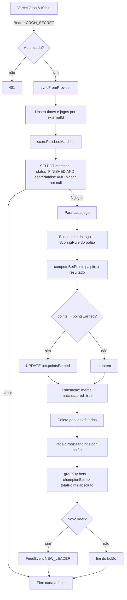

# Conferência Automática de Resultados — Bolão Copa 2026

> Revisão arquitetural + solução implementada para apuração automática de
> resultados, pontuação e ranking. Prioridades: simplicidade, performance,
> baixo custo, manutenibilidade. Sem microserviços, sem Redis, sem filas.

---

## 1. Revisão da arquitetura atual

A base **já estava bem desenhada** — a conferência não precisou ser criada do
zero, apenas endurecida e completada na UI.

| Camada | Arquivo | Avaliação |
|---|---|---|
| Provider de futebol | `src/server/providers/football/football-data.ts` | ✅ Bom. Football-Data v4, mapeia status/stage para enums internos, `revalidate: 60`. |
| Sync | `src/server/services/sync.ts` | ✅ Idempotente (upsert por `externalId`). Deriva grupos a partir dos jogos. |
| Scoring | `src/server/services/scoring.ts` | ✅ Função pura `computeBetPoints` + recálculo **absoluto** (não incremental). |
| Ranking | `src/server/services/ranking.ts` | ⚠️ `Membership.totalPoints` denormalizado (rápido). `exactHits` estava fixo em `0`. |
| Crons | `vercel.json` + `app/api/cron/*` | ⚠️ **Dois crons** (`sync-matches` 15min + `score` 10min) que pontuavam em paralelo → risco de corrida no `FeedEvent`. |
| UI | `src/components/match/match-card.tsx` | ⚠️ Mostrava só `+N pts`, sem distinguir placar exato / vencedor / não pontuou. |

### Problemas arquiteturais identificados
1. **Sobreposição de jobs**: dois caminhos de scoring concorrentes podiam emitir
   `NEW_LEADER` duplicado e disputar a escrita do ranking.
2. **UI incompleta** frente à spec (faltavam badges de conferência verde/vermelho).
3. `exactHits` nunca era calculado.

---

## 2. Arquitetura proposta (e implementada)

**Monólito Next.js (App Router) na Vercel + Postgres (Neon) via Prisma. Um único
Cron.** Nada de Redis/filas — desnecessário na escala alvo (ver §11).

```
Vercel Cron (*/10) ──GET──► /api/cron/sync-matches
                               │  1. syncFromProvider()   (upsert times+jogos)
                               │  2. scoreFinishedMatches() (sempre; idempotente)
                               ▼
                            Postgres (Neon)
                               ▲
        Server Components ─────┘ (leitura do ranking/jogos já apurados)
```

Decisão **Opção A (Cron) — híbrida light**: a Football-Data **não oferece
webhook**, então polling é a única via. Um único cron a cada 10 min sincroniza
placares e pontua na sequência. Confiável, custo ~0 (dentro do free tier),
trivial de manter. Webhook (Opção B) fica como evolução futura caso se troque de
provedor; estratégia híbrida (Opção C) não se justifica hoje.

---

## 3. Ajustes no banco de dados

O schema atual (`prisma/schema.prisma`) **já atende** ao modelo pedido, com nomes
próprios do domínio:

| Pedido | Modelo real | Observação |
|---|---|---|
| Match.processedAt | `Match.scored: Boolean` | Flag de idempotência basta; data não é usada. |
| Prediction | `Bet` (`homeGuess/awayGuess/pointsEarned`) | `@@unique([userId,poolId,matchId])`. |
| Bolao.scoringRules | `ScoringRule` (1:1 com `Pool`) | Pontos **configuráveis**, nada hardcoded. |
| Ranking.points | `Membership.totalPoints` (denormalizado) | `@@index([poolId, totalPoints desc])`. |

**Nenhuma migração necessária.** Índices relevantes já existem
(`Match.status`, `Bet[poolId,matchId]`, ranking). Sugestão opcional futura:
índice parcial `Match(status) WHERE scored = false` se o volume crescer muito —
desnecessário para 1 torneio (~104 jogos).

---

## 4. Fluxo Mermaid completo



---

## 5–9. Código (referências aos arquivos)

A solução está implementada nos arquivos abaixo. Trechos-chave:

- **Prisma** — `prisma/schema.prisma` (`Match.scored`, `ScoringRule`, `Membership.totalPoints`).
- **Next.js / Job de sync** — `src/app/api/cron/sync-matches/route.ts` (autenticado por `CRON_SECRET`, `maxDuration=60`) chama `syncFromProvider()` e **sempre** `scoreFinishedMatches()`.
- **Sync** — `src/server/services/sync.ts` (upsert idempotente por `externalId`).
- **Cálculo de pontuação** — `src/server/services/scoring.ts`:
  - `computeBetPoints(rule, guess, actual)` — pura, respeita `ScoringRule` do bolão.
  - `scoreFinishedMatches()` — apura jogos `FINISHED && !scored`.
- **Ranking** — `recalcPoolStandings(poolId)` em `scoring.ts` (recálculo absoluto via `groupBy`) e leitura em `src/server/services/ranking.ts` (agora com `exactHits`).
- **Classificador puro (UI)** — `src/lib/bet-result.ts` (`classifyBet`).

### Regra de pontuação (configurável, sem hardcode)
```
sameOutcome == false                 -> 0
placar exato                         -> base + pointsExactScore
acertou (vitória)                    -> pointsCorrectResult
acertou (empate)                     -> pointsCorrectDraw
```
Exemplos da spec: 2x1/2x1 → 3+1=4 ✅ · 1x0 p/ 2x1 → 3 ✅ · 1x1 p/ 2x1 → 0 ✅.

---

## 10. Componentes React

- `src/components/match/match-card.tsx`: placar grande = **Resultado Oficial**;
  abaixo do palpite, novo `ResultBadge` mostra:
  - 🎯 **Acertou o placar exato** `+N pts` (verde)
  - 🏆 **Acertou o vencedor / empate** `+N pts` (verde)
  - ❌ **Não pontuou** `0 pts` (vermelho)
- Sem modal — informação imediata abaixo do palpite. Cores via tokens
  `primary` (verde) / `destructive` (vermelho).

---

## 11. Estratégia de testes

| Tipo | Alvo | Como |
|---|---|---|
| Unit (puro) | `computeBetPoints`, `classifyBet` | Tabela de casos da spec (exato/vencedor/empate/erro). Sem DB. |
| Integração | `scoreFinishedMatches` | DB de teste (Neon branch). Roda 2× → pontuação **idêntica** (idempotência). |
| Integração | `recalcPoolStandings` | Soma bets+champion == `totalPoints`. |
| E2E leve | cron route | `GET` sem Bearer → 401; com Bearer → `{ok:true}`. |

Recomendado: `vitest` para as puras (rápidas, alto valor).

---

## 12. Idempotência, falhas e mitigação

**Por que é idempotente** (a garantia central): pontuação é **recalculada de forma
absoluta**, nunca incrementada.
- `bet.pointsEarned` é *setado* (`=`) ao valor computado, com guarda `if (points !== bet.pointsEarned)`.
- `membership.totalPoints` é recomputado por `groupBy` somando todas as bets + champion. Rodar o cron N vezes converge ao mesmo número.
- `match.scored=true` evita reprocessar o caminho normal.

| Falha | Mitigação |
|---|---|
| Cron roda 2× / sobreposição | **Resolvido**: um único cron. E recálculo absoluto torna re-execução inofensiva. |
| API fora do ar / 500 | `fdFetch` lança, route retorna 500, próximo tick reprocessa. Nada é marcado `scored`. |
| Jogo `FINISHED` sem placar | Filtro `homeScore/awayScore not null` impede pontuar incompleto. |
| Erro no meio do scoring | Transação por jogo; jogos não confirmados ficam `scored=false` e a rede de segurança (scoring sempre roda) reprocessa. |
| `NEW_LEADER` duplicado | Eliminada a concorrência entre crons que o causava. |
| Usuário tentar pontuar | Impossível: toda lógica é server-side, cron autenticado por `CRON_SECRET`; cliente só lê. |

---

## 13. Checklist de implementação

- [x] Provider Football-Data com mapeamento de status/stage
- [x] Sync idempotente por `externalId`
- [x] `computeBetPoints` puro respeitando `ScoringRule`
- [x] `scoreFinishedMatches` idempotente (`scored` + recálculo absoluto)
- [x] `recalcPoolStandings` (bets + champion → `totalPoints`)
- [x] **Cron único** `/api/cron/sync-matches` (sync + score) autenticado
- [x] UI: Resultado Oficial + badge de conferência (exato/vencedor/erro)
- [x] `classifyBet` puro reutilizável
- [x] `exactHits` real no ranking
- [x] `tsc --noEmit` limpo
- [ ] Testes `vitest` das funções puras (recomendado)
- [ ] `CRON_SECRET` configurado em produção (Vercel env)

---

## Autocrítica & versão ainda mais simples

A solução já é enxuta. Onde ela ainda pode simplificar/cuidar:

1. **`scoreFinishedMatches` carrega bets por jogo (N+1).** Para ~104 jogos e até
   1000 usuários é trivial, mas dá para fazer uma única query agrupando jogos.
   *Decisão: manter* — clareza > microperformance nesta escala.
2. **`recalcPoolStandings` recalcula o bolão inteiro a cada jogo.** Simples e
   correto; só vira problema com milhares de bolões — aí sim valeria fila. Hoje, não.
3. **Versão mais simples possível**: um endpoint só, dois services puros e a flag
   `scored` — que é exatamente o que ficou. Não há ganho real em reduzir mais sem
   perder legibilidade.

**Veredito:** a arquitetura monólito + 1 cron + recálculo absoluto é o ponto
ótimo entre simplicidade, custo e confiabilidade para este domínio. Filas/Redis
só se justificariam com múltiplos torneios simultâneos ou >10k bolões.
